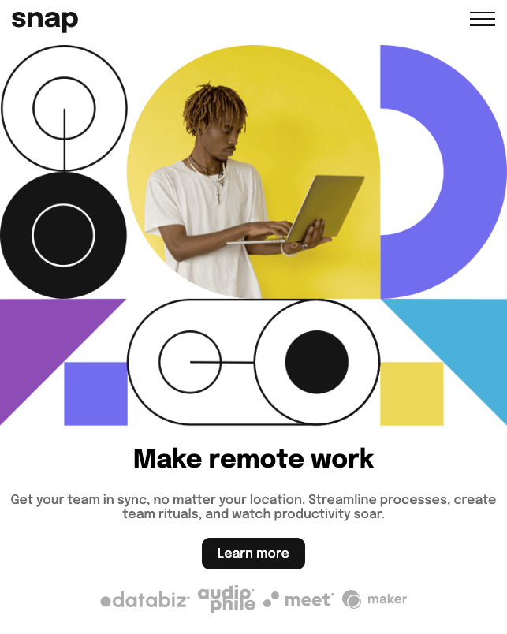
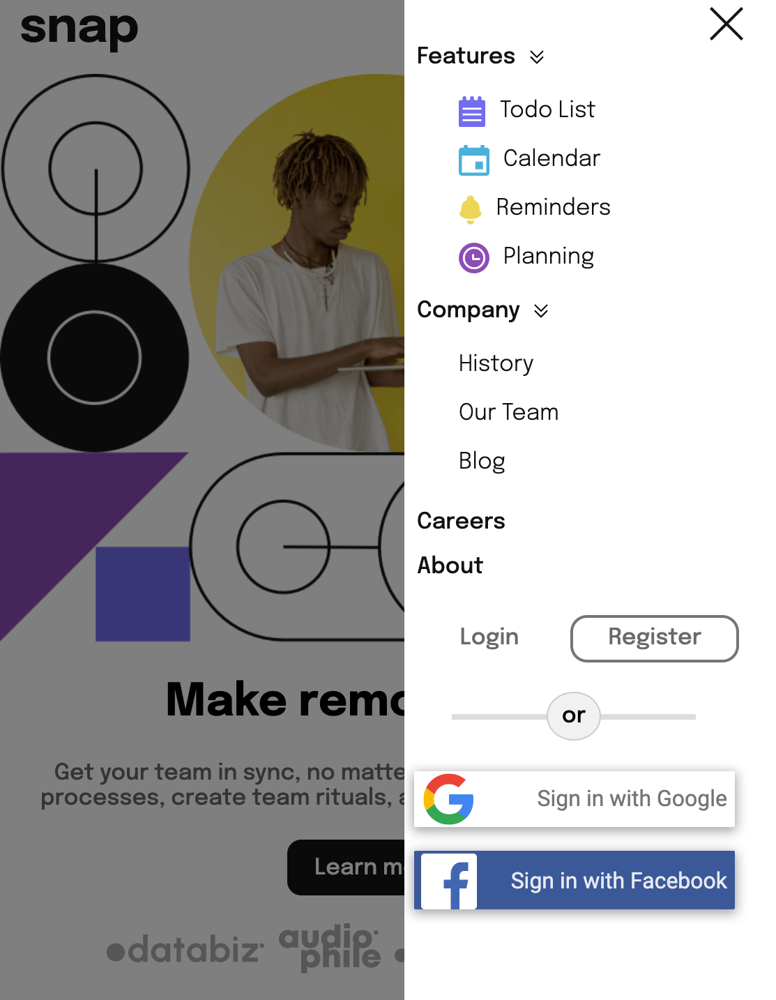
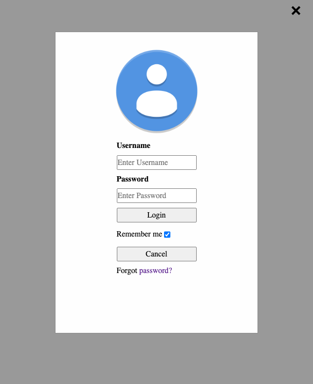
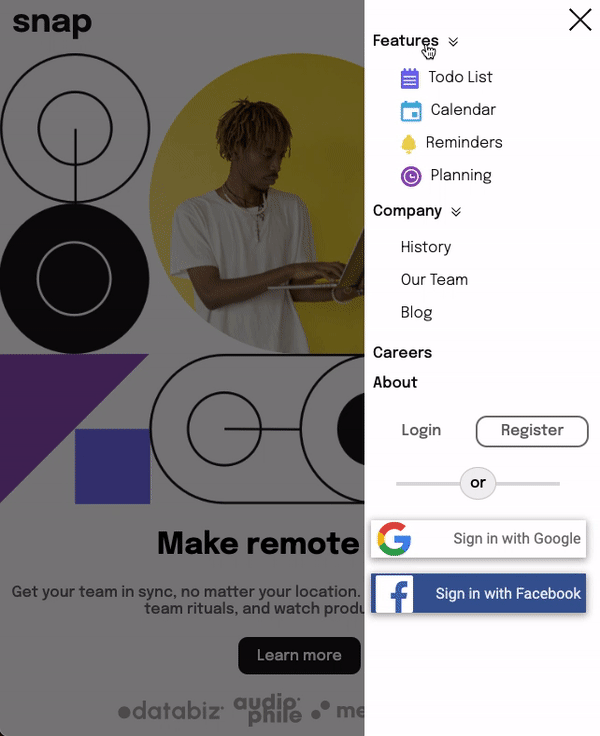

## Welcome !👋

Thanks for checking out this [Frontend Mentor](https://www.frontendmentor.io/) coding. This is my solution to the [Intro section with dropdown navigation](https://www.frontendmentor.io/challenges/intro-section-with-dropdown-navigation-ryaPetHE5). I have to build this application using only the preview images and the especifications.

<h1 align="center">Landing page with dropdown nav and Simple TODO list</h1>

   


Contents

- [🔰 About](#about)
  - [Layout](#layout)
- [🚀 Tech](#tech)
- [🎨 Style Guide](#style-guide)
  - [Colors:](#colors)
  - [Typography:](#typography)
- 📌[Features](#features)
- [📧 Author](#author)

## About

This is a simple responsive dropdown navigation menu with some effects using pure HTML, CSS and JS.  I added and created modal login form, a simple TODO list app and social media login form.

Your users should be able to:

* View the relevant dropdown menus on desktop and mobile when interacting with the navigation links
* View the optimal layout for the content depending on their device's screen size
* See hover states for all interactive elements on the page

<p align="center">
<a title="Icons8, MIT &lt;http://opensource.org/licenses/mit-license.php&gt;, via Wikimedia Commons" href="https://commons.wikimedia.org/wiki/File:Icons8_flat_todo_list.svg"></a>
</p>

Todo: A simple To-Do List Management App that helps you get things done. It can help you keep track of your daily plans. If you happen to have the habit of writing a mission plan, then it must be perfect for you.

A simple TO-DO app to store your todos. This also have a localStorage saving feature.

We all write out to-dos some where and then just forget them. At the end, nothing is done. But you can use this online to-do list app to store all your to-dos. Now if you just re-open the site you will have all your to-dos saved there waiting for you to check them.

+  Add task

+ Remove task

+ List completed task

+ List not completed task


The challenge
Users should be able to:

View the relevant dropdown menus on desktop and mobile when interacting with the navigation links
View the optimal layout for the content depending on their device's screen size
See hover states for all interactive elements on the page


### Layout



## Tech

- Semantic HTML5 markup
- CSS custom properties
- CSS Grid
- CSS FLEXBOX
- Mobile-first workflow

## Style Guide

### Colors:

```css
:root {
    --almost-white: hsl(0, 0%, 98%);
    --medium-gray: hsl(0, 0%, 41%);
    --almost-black: hsl(0, 0%, 8%);
}
```

## Typography:

### Body

* Font size: 1.6rem;

### Font

* font-family:'Epilogue', sans-serif;
  `<br>`
* font-weight: 300; 500
  `<br>`
  (you can find the font in [Google Font](https://fonts.google.com/))

## Features

* 🎨 Focus on menu-list using the general sibling selector.
* 👨‍🔬 Navigation menu dropdown with pure CSS and Custom hover effect and opacity on menu list!
* 📱 Mobile-first design workflow
* 😎  I added and created modal Login form, TODO list app and social media login form

## Author

**David Willian Chaves**

- https://www.linkedin.com/in/david0chaves/
- https://github.com/davidchaves
- https://twitter.com/david__chaves
- https://www.instagram.com/david_.chaves/
