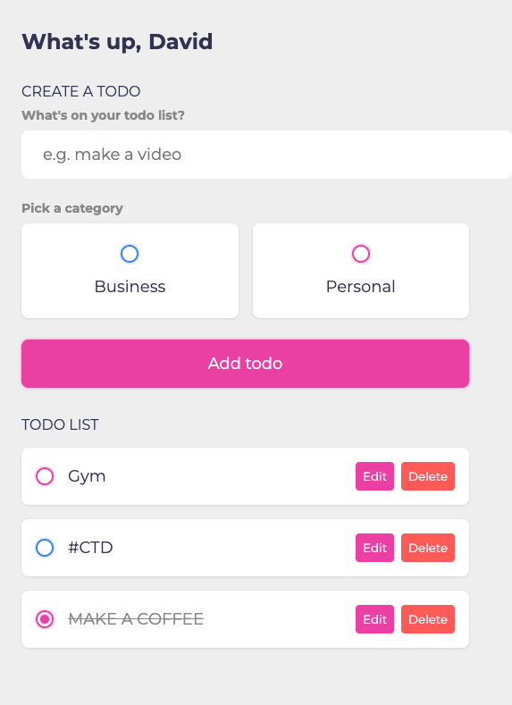

## Welcome !👋

Thanks for checking out this [Frontend Mentor](https://www.frontendmentor.io/) coding. This is my solution to the [Intro section with dropdown navigation](https://www.frontendmentor.io/challenges/intro-section-with-dropdown-navigation-ryaPetHE5). I have to build this application using only the preview images and the especifications.

<h1 align="center">Landing page with dropdown nav</h1>

   


Contents

- [🔰 About](#about)
  - [Layout](#layout)
- [🚀 Tech](#tech)
- [🎨 Style Guide](#style-guide)
  - [Colors:](#colors)
  - [Typography:](#typography)
- 📌[Features](#features)
- [📧 Author](#author)

## About

This is a simple responsive dropdown navigation menu with some effects using pure HTML, CSS and JS.  I added and created modal login form, a simple TODO list app and social media login form.

Your users should be able to:

* View the relevant dropdown menus on desktop and mobile when interacting with the navigation links
* View the optimal layout for the content depending on their device's screen size
* See hover states for all interactive elements on the page

### Layout


## Tech

- Semantic HTML5 markup
- CSS custom properties
- CSS Grid
- CSS FLEXBOX
- Mobile-first workflow

## Style Guide

### Colors:

```css
:root {
    --almost-white: hsl(0, 0%, 98%);
    --medium-gray: hsl(0, 0%, 41%);
    --almost-black: hsl(0, 0%, 8%);
}
```

## Typography:

### Body

* Font size: 1.6rem;

### Font

* font-family:'Epilogue', sans-serif;
  `<br>`
* font-weight: 300; 500
  `<br>`
  (you can find the font in [Google Font](https://fonts.google.com/))

## Features

* 🎨 Focus on menu-list using the general sibling selector.
* 👨‍🔬 Navigation menu dropdown with pure CSS and Custom hover effect and opacity on menu list!
* 📱 Mobile-first design workflow
* 😎  I added and created modal Login form, TODO list app and social media login form

## Author

**David Willian Chaves**

- https://www.linkedin.com/in/david0chaves/
- https://github.com/davidchaves
- https://twitter.com/david__chaves
- https://www.instagram.com/david_.chaves/
